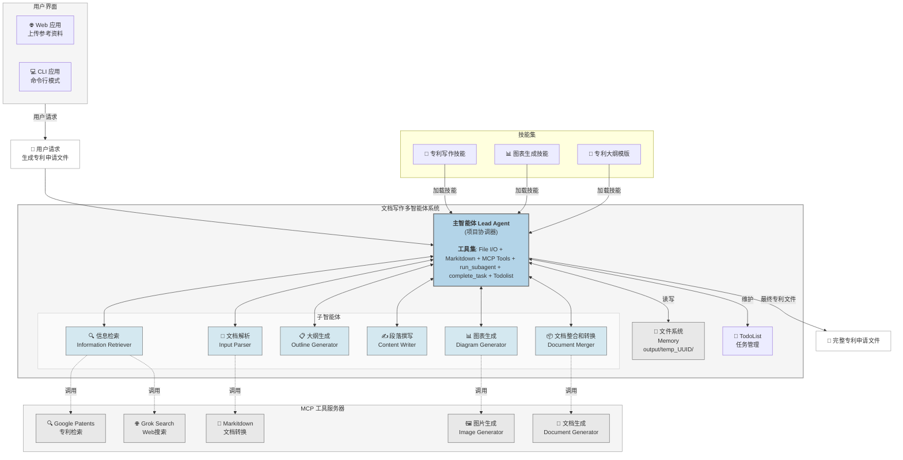

# 专利写作多智能体系统架构

## 高层架构图（High-level Architecture）

```mermaid
graph TB
    %% 用户界面
    subgraph UserInterface["用户界面"]
        direction LR
        WebUI["🌐 Web 应用<br/>上传参考资料"]
        CLI["💻 CLI 应用<br/>命令行模式"]
    end

    %% 用户请求
    UserRequest["📄 用户请求<br/>生成专利申请文件"]

    %% 多智能体系统
    subgraph MultiAgent["文档写作多智能体系统"]
        direction TB

        %% 主智能体
        LeadAgent["<b>主智能体 Lead Agent</b><br/>(项目协调器)<br/><br/><b>工具集</b>: File I/O + Markitdown + MCP Tools + run_subagent + complete_task + Todolist"]

        %% 子智能体
        subgraph Subagents["子智能体"]
            direction LR
            S1["📄 文档解析<br/>Input Parser"]
            S2["🔍 信息检索<br/>Information Retriever"]
            S3["📋 大纲生成<br/>Outline Generator"]
            S4["✍️ 段落撰写<br/>Content Writer"]
            S5["📊 图表生成<br/>Diagram Generator"]
            S6["📦 文档整合和转换<br/>Document Merger"]
        end

        %% 文件系统
        Memory["💾 文件系统<br/>Memory<br/>output/temp_UUID/"]

        %% TODO管理
        TodoList["📝 TodoList<br/>任务管理"]
    end

    %% MCP工具层
    subgraph MCPTools["MCP 工具服务器"]
        direction LR
        GooglePatents["🔍 Google Patents<br/>专利检索"]
        GrokSearch["🌐 Grok Search<br/>Web搜索"]
        Markitdown["📝 Markitdown<br/>文档转换"]
        ImageGenerator["🖼️ 图片生成<br/>Image Generator"]
        DocumentGenerator["📄 文档生成<br/>Document Generator"]
    end

    %% 连接关系
    UserInterface -->|用户请求| UserRequest
    UserRequest --> LeadAgent

    LeadAgent <--> S1
    LeadAgent <--> S2
    LeadAgent <--> S3
    LeadAgent <--> S4
    LeadAgent <--> S5
    LeadAgent <--> S6

    LeadAgent <-->|读写| Memory
    LeadAgent <-->|维护| TodoList

    S1 -.调用.-> Markitdown
    S2 -.调用.-> GooglePatents
    S2 -.调用.-> GrokSearch
    S5 -.调用.-> ImageGenerator
    S6 -.调用.-> DocumentGenerator

    LeadAgent -->|最终专利文件| FinalOutput["📑 完整专利申请文件"]

    subgraph Skills["技能集"]
        direction LR
        PatentSkills["🔧 专利写作技能"]
        DiagramSkills["📊 图表生成技能"]
        PatentOutline["📑 专利大纲模版"]
    end

    PatentSkills -->|加载技能| LeadAgent
    DiagramSkills -->|加载技能| LeadAgent
    PatentOutline -->|加载技能| LeadAgent


    %% 样式定义
    style LeadAgent fill:#B3D4E8,stroke:#666,stroke-width:2px,color:#333
    style S1 fill:#D4E8F0,stroke:#666,stroke-width:1px,color:#333
    style S2 fill:#D4E8F0,stroke:#666,stroke-width:1px,color:#333
    style S3 fill:#D4E8F0,stroke:#666,stroke-width:1px,color:#333
    style S4 fill:#D4E8F0,stroke:#666,stroke-width:1px,color:#333
    style S5 fill:#D4E8F0,stroke:#666,stroke-width:1px,color:#333
    style S6 fill:#D4E8F0,stroke:#666,stroke-width:1px,color:#333
    style Memory fill:#E8E8E8,stroke:#666,stroke-width:1px,color:#333
    style GooglePatents fill:#E8E8E8,stroke:#666,stroke-width:1px,color:#333
    style GrokSearch fill:#E8E8E8,stroke:#666,stroke-width:1px,color:#333
    style Markitdown fill:#E8E8E8,stroke:#666,stroke-width:1px,color:#333
    style DocumentGenerator fill:#E8E8E8,stroke:#666,stroke-width:1px,color:#333
    style ImageGenerator fill:#E8E8E8,stroke:#666,stroke-width:1px,color:#333

    style UserInterface fill:#F5F5F5,stroke:#999,stroke-width:1px
    style MultiAgent fill:#F5F5F5,stroke:#999,stroke-width:2px
    style MCPTools fill:#F5F5F5,stroke:#999,stroke-width:1px
    style Subagents fill:#FAFAFA,stroke:#CCC,stroke-width:1px
    style UserRequest fill:#FFF,stroke:#999,stroke-width:1px,color:#333
    style FinalOutput fill:#FFF,stroke:#999,stroke-width:1px,color:#333
```